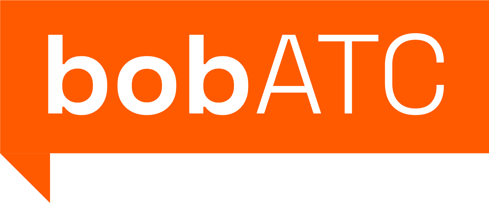

<p align="center"></p>

## Jaehyun Lim 18-224 Spring 2024 Final Tapeout Project

Visit [BobATC](https://github.com/jobitaki/BobATC) for the original source code for the project in SystemVerilog.

## Overview

bobATC is a simplistic air traffic controller on a chip that clears planes for takeoff and landing on a 2 runway airport. 

## How it Works

bobATC controls a hypothetical airspace around a small-scale 2-runway airport. Planes request departure, landing, or emergency to bobATC. To be able to request anything, aircraft must first request an ID to be assigned to their aircraft for the purposes of communication.

bobATC communicates with aircraft via a messaging system structured with 8-bit packets shown below:

| Aircraft ID   | Message Type  | Action |
|:-------------:|:-------------:|:------:|
| 4 bits        | 3 bits        | 1 bit  |

The 8-bit packets are sent in and received through bobATC's UART pins. Because there are 4-bit aircraft IDs, bobATC can handle up to 16 aircraft at a time. The message type bits correspond to the type of request/reply of the packet, and the action bit further helps specify what the packet means. The message types are detailed below:

| Message Type    | Binary | Direction | Meaning |
|:-------------:  |:------:|:------  | :- |
| REQUEST         | 000    | Aircraft => bobATC | Aircraft requests landing or takeoff. bobATC will respond with either a clearance, hold, or divert depending on airport runway availability, the number of airplanes queued to land or takeoff (8 max), or emergency status of the airport. |
| DECLARE         | 001    | Aircraft => bobATC | Aircraft declares that it has landed or departed from runway ID specified by action bit. Aircraft loses its 4-bit ID designation (only if the declaration is valid, as in the aircraft correctly names the runway it has taken off from. That runway is freed for other aircraft). |
| EMERGENCY       | 010    | Aircraft => bobATC | Aircraft declares or resolves ongoing emergency. Action bit 1 declares emergency, 0 resolves emergency. Only the aircraft that originally declared an emergency can resolve it. If multiple aircraft declare emergencies, only the latest one that declared it can resolve it. bobATC will close all runways, meaning no takeoffs will be cleared and all landings will be diverted until the emergency is resolved. Aircraft loses its 4-bit ID designation upon resolving emergency. No message is sent by bobATC, the aircraft can assume it may land on any free runway. |
| CLEAR           | 011    | bobATC => Aircraft | bobATC clears an aircraft's request to takeoff or land. Action bit specifies runway to use. When there are multiple aircraft queued up to land or takeoff, bobATC will alternate between landings and takeoffs to ensure fairness. |
| HOLD            | 100    | bobATC => Aircraft | bobATC tells an aircraft to wait until clearance. The aircraft is added to a queue of aircraft waiting for clearance to takeoff or land. |
| SAY_AGAIN       | 101    | bobATC => Aircraft | bobATC tells an aircraft that the message type is invalid. |
| DIVERT          | 110    | bobATC => Aircraft | bobATC tells an aircraft to divert, either due to congestion or emergency. Aircraft loses its 4-bit ID designation |
| ID_PLEASE       | 111    | Bi-directional | Aircraft requests an unused ID from bobATC. bobATC sends out a valid ID on its Aircraft ID bits, or sends out this message type with action bit 1 to convey that the airspace is full and does not have unused IDs. |

bobATC manages two runways parallel to each other, each with an ID of either 0 or 1. To ensure that a runway is used by only one aircraft at a time, bobATC locks each runway whenever it clears an aircraft to land or takeoff from a runway. Only after that aircraft declares that it landed or took off from the specific runway will bobATC allow new clearances on that runway. If a runway needs to be closed off for external reasons (such as for repair), the chip has two inputs called runway_override that will close off a runway if set to high. An emergency can also be triggered by setting the emergency_override to high.

## Inputs/Outputs

| IO Type | IO Pin | Name | Function |
|:--------|:-------|:-----|:---------|
| Input   | io_in[0] | rx | UART receiver |
| Input   | io_in[1] | runway_override[0] | Set high to make runway 0 unusable |
| Input   | io_in[2] | runway_override[1] | Set high to make runway 1 unusable |
| Input   | io_in[3] | emergency_override | Set high to force emergency |
| Output | io_out[0] | tx | UART transmitter |
| Output | io_out[1] | framing_error | Indicates if UART receiver detects a framing error |
| Output | io_out[3:2] | runway_active[1:0] | Indicates the status of runways 0 and 1, whether they are being used or not |
| Output | io_out[4] | emergency | Indicates whether an emergency is ongoing or not |
| Output | io_out[5] | receiving | Indicates that the UART receiver is receiving new data |
| Output | io_out[6] | sending | Indicates that the UART transmitter is sending new data |

bobATC must be run at 25MHz to achieve 115200 baud rate.

## Hardware Peripherals

bobATC requires external hardware to interface with its UART pins, such as an Arduino or a simple USB to UART adapter. You will need multithreading abilities in your code to be able to take advantage of bobATC's full duplex communication.

## Design Testing / Bringup

Testing bobATC was done with a self-checking testbench in cocoTB with Icarus Verilog as the simulator. The testbench sends out a bunch of requests and waits for the expected replies from bobATC, as well as checking various status points inside of bobATC itself. 

To test bobATC yourself, make sure all inputs and outputs are wired properly (make sure the override pins are grounded if you do not want to trigger an emergency or lock both runways!). Make sure you have hardware capable of sending and receiving UART transmissions through pySerial. Use the python script [bobATC_helper.py](https://github.com/jobitaki/bobATC_tapeout/blob/main/bobATC_helper.py) to send requests to bobATC. The script will prompt you for the Aircraft ID, Request, and Action bit, assemble it into a packet, send it to the chip, and listen for a response. Input ID 44 will quit the script and close the serial port. Below is a sample sequence of requests you can make to bobATC for a simple test. 

```
////////////////////////////////////////
//         Begin basic tests          //
////////////////////////////////////////

New Plane: Requesting ID for entry at time 87260.0
Bob      : ID 0 is available

////////////////////////////////////////
// TB      : Transaction success!     //
////////////////////////////////////////

Plane 00 : Requesting takeoff at time 261660.0
Bob      : Plane 00 hold
Bob      : Plane 00 cleared runway 0

////////////////////////////////////////
// TB      : Transaction success!     //
////////////////////////////////////////

New Plane: Requesting ID for entry at time 523260.0
Bob      : ID 1 is available

////////////////////////////////////////
// TB      : Transaction success!     //
////////////////////////////////////////

Plane 01 : Requesting landing at time 697660.0
Bob      : Plane 01 hold
Bob      : Plane 01 cleared runway 1

////////////////////////////////////////
// TB      : Transaction success!     //
////////////////////////////////////////

New Plane: Requesting ID for entry at time 959260.0
Bob      : ID 2 is available

////////////////////////////////////////
// TB      : Transaction success!     //
////////////////////////////////////////

Plane 02 : Requesting takeoff at time 1133660.0
Bob      : Plane 02 hold

////////////////////////////////////////
// TB      : Transaction success!     //
////////////////////////////////////////

Plane 00 : Declaring takeoff/landing runway 0 at time 1308060.0
Bob      : Plane 02 cleared runway 0

////////////////////////////////////////
// TB      : Transaction success!     //
////////////////////////////////////////

New Plane: Requesting ID for entry at time 1482460.0
Bob      : ID 0 is available

////////////////////////////////////////
// TB      : Transaction success!     //
////////////////////////////////////////

////////////////////////////////////////
//         Finish basic tests         //
////////////////////////////////////////
```

## Media

[Demo video](https://drive.google.com/file/d/1z_5k1JWJLRvMM7I70JxbEHWm40HmHs1p/view?usp=sharing) of bobATC running on an FPGA being interfaced with bobATC_helper.py.

#### Example testbench output
Alternating takeoff/landing test
```
////////////////////////////////////////////////////
// Begin alternating takeoff/landing stress tests //
////////////////////////////////////////////////////

FST info: dumpfile sim_build/BobTop.fst opened for output.
New Plane: Requesting ID for entry at time 87260.0
Bob      : ID 0 is available

////////////////////////////////////////
// TB      : Transaction success!     //
////////////////////////////////////////

New Plane: Requesting ID for entry at time 261660.0
Bob      : ID 1 is available

////////////////////////////////////////
// TB      : Transaction success!     //
////////////////////////////////////////

New Plane: Requesting ID for entry at time 436060.0
Bob      : ID 2 is available

////////////////////////////////////////
// TB      : Transaction success!     //
////////////////////////////////////////

New Plane: Requesting ID for entry at time 610460.0
Bob      : ID 3 is available

////////////////////////////////////////
// TB      : Transaction success!     //
////////////////////////////////////////

New Plane: Requesting ID for entry at time 784860.0
Bob      : ID 4 is available

////////////////////////////////////////
// TB      : Transaction success!     //
////////////////////////////////////////

New Plane: Requesting ID for entry at time 959260.0
Bob      : ID 5 is available

////////////////////////////////////////
// TB      : Transaction success!     //
////////////////////////////////////////

New Plane: Requesting ID for entry at time 1133660.0
Bob      : ID 6 is available

////////////////////////////////////////
// TB      : Transaction success!     //
////////////////////////////////////////

New Plane: Requesting ID for entry at time 1308060.0
Bob      : ID 7 is available

////////////////////////////////////////
// TB      : Transaction success!     //
////////////////////////////////////////

New Plane: Requesting ID for entry at time 1482460.0
Bob      : ID 8 is available

////////////////////////////////////////
// TB      : Transaction success!     //
////////////////////////////////////////

New Plane: Requesting ID for entry at time 1656860.0
Bob      : ID 9 is available

////////////////////////////////////////
// TB      : Transaction success!     //
////////////////////////////////////////

New Plane: Requesting ID for entry at time 1831260.0
Bob      : ID 10 is available

////////////////////////////////////////
// TB      : Transaction success!     //
////////////////////////////////////////

New Plane: Requesting ID for entry at time 2005660.0
Bob      : ID 11 is available

////////////////////////////////////////
// TB      : Transaction success!     //
////////////////////////////////////////

New Plane: Requesting ID for entry at time 2180060.0
Bob      : ID 12 is available

////////////////////////////////////////
// TB      : Transaction success!     //
////////////////////////////////////////

New Plane: Requesting ID for entry at time 2354460.0
Bob      : ID 13 is available

////////////////////////////////////////
// TB      : Transaction success!     //
////////////////////////////////////////

New Plane: Requesting ID for entry at time 2528860.0
Bob      : ID 14 is available

////////////////////////////////////////
// TB      : Transaction success!     //
////////////////////////////////////////

New Plane: Requesting ID for entry at time 2703260.0
Bob      : ID 15 is available

////////////////////////////////////////
// TB      : Transaction success!     //
////////////////////////////////////////

Plane 00 : Requesting takeoff at time 2877660.0
Bob      : Plane 00 hold
Bob      : Plane 00 cleared runway 1

////////////////////////////////////////
// TB      : Transaction success!     //
////////////////////////////////////////

Plane 01 : Requesting takeoff at time 3139260.0
Bob      : Plane 01 hold

////////////////////////////////////////
// TB      : Transaction success!     //
////////////////////////////////////////

Plane 02 : Requesting takeoff at time 3313660.0
Bob      : Plane 02 hold

////////////////////////////////////////
// TB      : Transaction success!     //
////////////////////////////////////////

Plane 03 : Requesting takeoff at time 3488060.0
Bob      : Plane 03 hold

////////////////////////////////////////
// TB      : Transaction success!     //
////////////////////////////////////////

Plane 04 : Requesting takeoff at time 3662460.0
Bob      : Plane 04 hold

////////////////////////////////////////
// TB      : Transaction success!     //
////////////////////////////////////////

Plane 05 : Requesting takeoff at time 3836860.0
Bob      : Plane 05 hold

////////////////////////////////////////
// TB      : Transaction success!     //
////////////////////////////////////////

Plane 06 : Requesting takeoff at time 4011260.0
Bob      : Plane 06 hold

////////////////////////////////////////
// TB      : Transaction success!     //
////////////////////////////////////////

Plane 07 : Requesting takeoff at time 4185660.0
Bob      : Plane 07 hold

////////////////////////////////////////
// TB      : Transaction success!     //
////////////////////////////////////////

Plane 08 : Requesting landing at time 4360060.0
Bob      : Plane 08 hold

////////////////////////////////////////
// TB      : Transaction success!     //
////////////////////////////////////////

Plane 09 : Requesting landing at time 4534460.0
Bob      : Plane 09 hold

////////////////////////////////////////
// TB      : Transaction success!     //
////////////////////////////////////////

Plane 10 : Requesting landing at time 4708860.0
Bob      : Plane 10 hold

////////////////////////////////////////
// TB      : Transaction success!     //
////////////////////////////////////////

Plane 11 : Requesting landing at time 4883260.0
Bob      : Plane 11 hold

////////////////////////////////////////
// TB      : Transaction success!     //
////////////////////////////////////////

Plane 12 : Requesting landing at time 5057660.0
Bob      : Plane 12 hold

////////////////////////////////////////
// TB      : Transaction success!     //
////////////////////////////////////////

Plane 13 : Requesting landing at time 5232060.0
Bob      : Plane 13 hold

////////////////////////////////////////
// TB      : Transaction success!     //
////////////////////////////////////////

Plane 14 : Requesting landing at time 5406460.0
Bob      : Plane 14 hold

////////////////////////////////////////
// TB      : Transaction success!     //
////////////////////////////////////////

Plane 15 : Requesting landing at time 5580860.0
Bob      : Plane 15 hold

////////////////////////////////////////
// TB      : Transaction success!     //
////////////////////////////////////////

Plane 00 : Declaring takeoff/landing runway 1 at time 5755260.0
Bob      : Plane 08 cleared runway 1

////////////////////////////////////////
// TB      : Transaction success!     //
////////////////////////////////////////

Plane 08 : Declaring takeoff/landing runway 1 at time 5929660.0
Bob      : Plane 01 cleared runway 1

////////////////////////////////////////
// TB      : Transaction success!     //
////////////////////////////////////////

Plane 01 : Declaring takeoff/landing runway 1 at time 6104060.0
Bob      : Plane 09 cleared runway 1

////////////////////////////////////////
// TB      : Transaction success!     //
////////////////////////////////////////

New Plane: Requesting ID for entry at time 6278460.0
Bob      : ID 0 is available

////////////////////////////////////////
// TB      : Transaction success!     //
////////////////////////////////////////

Plane 09 : Declaring takeoff/landing runway 1 at time 6452860.0
Bob      : Plane 02 cleared runway 1

////////////////////////////////////////
// TB      : Transaction success!     //
////////////////////////////////////////

Plane 02 : Declaring takeoff/landing runway 1 at time 6627260.0
Bob      : Plane 10 cleared runway 1

////////////////////////////////////////
// TB      : Transaction success!     //
////////////////////////////////////////

Plane 10 : Declaring takeoff/landing runway 1 at time 6801660.0
Bob      : Plane 03 cleared runway 1

////////////////////////////////////////
// TB      : Transaction success!     //
////////////////////////////////////////

Plane 03 : Declaring takeoff/landing runway 1 at time 6976060.0
Bob      : Plane 11 cleared runway 1

////////////////////////////////////////
// TB      : Transaction success!     //
////////////////////////////////////////

Plane 11 : Declaring takeoff/landing runway 1 at time 7150460.0
Bob      : Plane 04 cleared runway 1

////////////////////////////////////////
// TB      : Transaction success!     //
////////////////////////////////////////

Plane 04 : Declaring takeoff/landing runway 1 at time 7324860.0
Bob      : Plane 12 cleared runway 1

////////////////////////////////////////
// TB      : Transaction success!     //
////////////////////////////////////////

Plane 12 : Declaring takeoff/landing runway 1 at time 7499260.0
Bob      : Plane 05 cleared runway 1

////////////////////////////////////////
// TB      : Transaction success!     //
////////////////////////////////////////

Plane 05 : Declaring takeoff/landing runway 1 at time 7673660.0
Bob      : Plane 13 cleared runway 1

////////////////////////////////////////
// TB      : Transaction success!     //
////////////////////////////////////////

Plane 13 : Declaring takeoff/landing runway 1 at time 7848060.0
Bob      : Plane 06 cleared runway 1

////////////////////////////////////////
// TB      : Transaction success!     //
////////////////////////////////////////

Plane 06 : Declaring takeoff/landing runway 1 at time 8022460.0
Bob      : Plane 14 cleared runway 1

////////////////////////////////////////
// TB      : Transaction success!     //
////////////////////////////////////////

Plane 14 : Declaring takeoff/landing runway 1 at time 8196860.0
Bob      : Plane 07 cleared runway 1

////////////////////////////////////////
// TB      : Transaction success!     //
////////////////////////////////////////

Plane 07 : Declaring takeoff/landing runway 1 at time 8371260.0
Bob      : Plane 15 cleared runway 1

////////////////////////////////////////
// TB      : Transaction success!     //
////////////////////////////////////////

Plane 15 : Declaring takeoff/landing runway 1 at time 8545660.0
/////////////////////////////////////////////////////
// Finish alternating takeoff/landing stress tests //
/////////////////////////////////////////////////////
```
